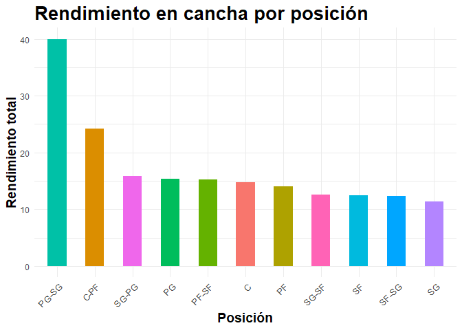
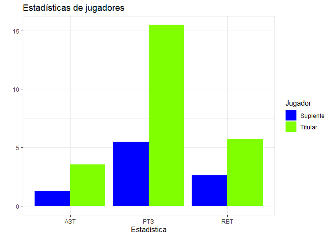
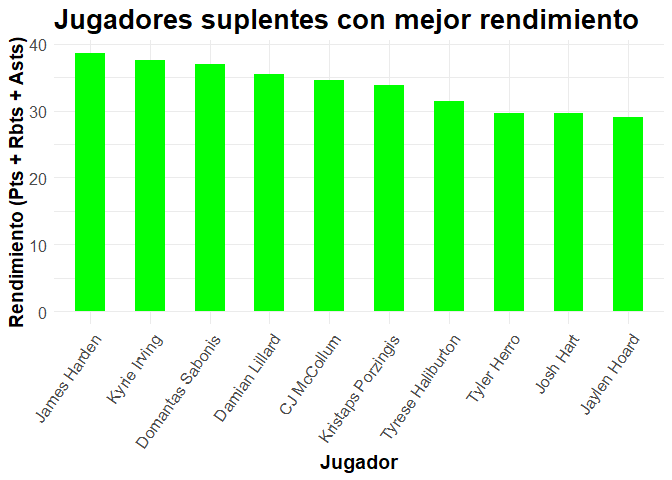
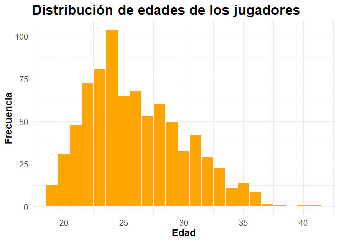
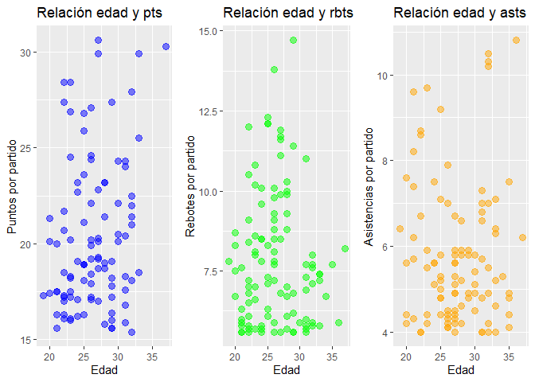
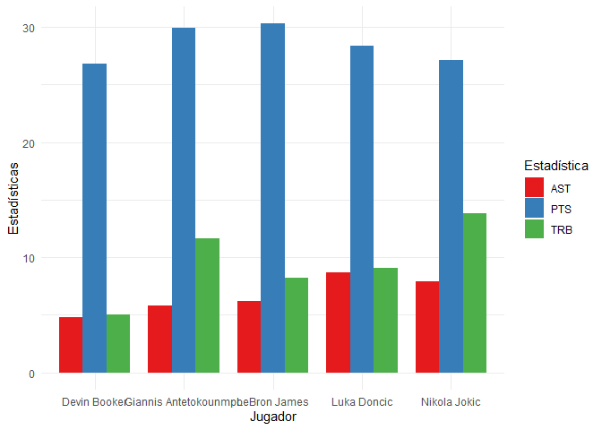
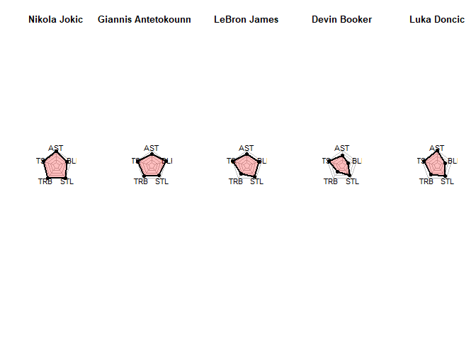

NBA EDA & Visualization (2023)
================
Alejandro
5/6/2023

``` r
# Configuración global de knitr
knitr::opts_chunk$set(
  echo = TRUE,      # mostrar código
  warning = FALSE,  # ocultar warnings
  message = FALSE   # ocultar mensajes
)
```

# Trabajo Final: AEDV 2023

``` r
library(ggplot2)
library(scales)
library(dplyr)
library(gridExtra)
library(fmsb)

# Cargar el conjunto de datos de equipos
teams <- read.csv("data/mega_nba2023.csv")

# Cargar el conjunto de datos de estadísticas de jugadores
player_stats <- read.csv("data/2021-2022 NBA Player Stats - Regular.csv", header = T, sep = ";")

library(dplyr)

player_stats <- player_stats %>%
  group_by(Player) %>%
  top_n(1, G)
```

Gráfica que ordena las posiciones de los jugadores según su rendimiento,
teniendo en cuenta puntos, rebotes y asistencias:

``` r
# Calcular el promedio de puntos, rebotes y asistencias por posición
avg_stats <- aggregate(cbind(PTS, TRB, AST) ~ Pos, data = player_stats, FUN = mean)

# Calcular el rendimiento total sumando los promedios de puntos, rebotes y asistencias
avg_stats$total_performance <- avg_stats$PTS + avg_stats$TRB + avg_stats$AST

# Ordenar las posiciones por rendimiento total en orden descendente
sorted_positions <- avg_stats[order(-avg_stats$total_performance), ]

# Crear un gráfico de barras para mostrar el rendimiento por posición
ggplot(sorted_positions, aes(x = reorder(Pos, -total_performance), y = total_performance, fill = Pos)) +
  geom_bar(stat = "identity", width = 0.5) +
  labs(x = "Posición", y = "Rendimiento total", title = "Rendimiento en cancha por posición") +
  theme_minimal() +
  theme(plot.title = element_text(face = "bold", size = 20),
        axis.title = element_text(face = "bold", size = 14),
        axis.text.x = element_text(angle = 45, hjust = 1, size = 10),
        legend.position = "none")
```

<!-- -->

Comparación de rendimiento entre jugadores titulares y suplentes.

``` r
# Calcular el promedio de puntos, rebotes y asistencias para jugadores titulares
starters <- subset(player_stats, GS >= 30)
starters_avg <- colMeans(starters[c("PTS", "TRB", "AST")], na.rm = TRUE)

# Calcular el promedio de puntos, rebotes y asistencias para jugadores suplentes
bench <- subset(player_stats, GS < 30)
bench_avg <- colMeans(bench[c("PTS", "TRB", "AST")], na.rm = TRUE)

# Creamos un DataFrame
titular_suplente <- data.frame(
  PTS = c(starters_avg[1], bench_avg[1]),
  RBT = c(starters_avg[2], bench_avg[2]),
  AST = c(starters_avg[3], bench_avg[3]),
  Jugador = c("Titular", "Suplente")
)

# Lo convertimos a formato long
titular_suplente_long <- tidyr::gather(
  titular_suplente,
  variable,
  valor,
  -Jugador
)

# Creamos el gráfico
ggplot(titular_suplente_long, aes(x = variable, y = valor, fill = Jugador)) +
  geom_bar(stat = "identity", position = "dodge") +
  labs(title = "Estadísticas de jugadores", x = "Estadística", y = " ") +
  scale_fill_manual(values = c("Titular" = "#7FFF00", "Suplente" = "#0000FF")) +
  theme_bw()
```

<!-- -->

Jugadores suplentes con mejor rendimiento.

``` r
# Como se han realizado tratamientos anteriores necesitamos eliminarlos para poder establecer esta relación, para ello volvemos a insertar el archivo
player_stats <- read.csv("data/2021-2022 NBA Player Stats - Regular.csv", header = T, sep = ";")

# Crear variable para establecer si el jugador es titular o suplente
player_stats$Status <- ifelse(player_stats$GS > 30, "Titular", "Suplente")

# Filtrar jugadores suplentes
suplentes <- subset(player_stats, Status == "Suplente")

suplentes <- suplentes %>%
  group_by(Player) %>%
  top_n(1, G)

# Creamos una nueva variable llamada REND que mide el rendimiento del jugador (puntos + rebotes + asistencias)
suplentes$REND <- suplentes$PTS + suplentes$TRB + suplentes$AST

# Ordenar los jugadores suplentes por su rendimiento (puntos + rebotes + asistencias) en orden descendente
suplentes_ordenados <- suplentes[rev(order(suplentes$REND)),]

# Seleccionar los 10 jugadores suplentes con mejor rendimiento
top_suplentes <- head(suplentes_ordenados, 10)
top_suplentes
```

    ## # A tibble: 10 x 32
    ## # Groups:   Player [10]
    ##       Rk Player      Pos     Age Tm        G    GS    MP    FG   FGA   FG.   X3P
    ##    <int> <chr>       <chr> <int> <chr> <int> <int> <dbl> <dbl> <dbl> <dbl> <dbl>
    ##  1   218 James Hard~ SG       32 PHI      21    21  37.7   5.5  13.6 0.402   2.2
    ##  2   266 Kyrie Irvi~ PG       29 BRK      29    29  37.6  10    21.2 0.469   3.4
    ##  3   488 Domantas S~ PF       25 SAC      15    15  33.6   7.5  13.5 0.554   0.3
    ##  4   332 Damian Lil~ PG       31 POR      29    29  36.4   7.7  19   0.402   3.2
    ##  5   362 CJ McCollum SG       30 NOP      26    26  33.8   9.5  19.2 0.493   2.7
    ##  6   455 Kristaps P~ PF       26 WAS      17    17  28.2   7.2  15.2 0.475   1.7
    ##  7   214 Tyrese Hal~ PG       21 IND      26    26  36.1   6.2  12.4 0.502   2.2
    ##  8   236 Tyler Herro SG       22 MIA      66    10  32.6   7.6  17   0.447   2.7
    ##  9   226 Josh Hart   SF       26 POR      13    13  32.1   7.1  14.1 0.503   2.4
    ## 10   243 Jaylen Hoa~ SF       22 OKC       7     5  34.3   6.3  12.9 0.489   1.3
    ## # i 20 more variables: X3PA <dbl>, X3P. <dbl>, X2P <dbl>, X2PA <dbl>,
    ## #   X2P. <dbl>, eFG. <dbl>, FT <dbl>, FTA <dbl>, FT. <dbl>, ORB <dbl>,
    ## #   DRB <dbl>, TRB <dbl>, AST <dbl>, STL <dbl>, BLK <dbl>, TOV <dbl>, PF <dbl>,
    ## #   PTS <dbl>, Status <chr>, REND <dbl>

``` r
# Al visualizarla nos damos cuenta que un nombre sale mal escrito por lo que lo modificamos manualmente
top_suplentes$Player <- ifelse(top_suplentes$Player == "Kristaps Porzi??is", "Kristaps Porzingis", top_suplentes$Player)

# Crear un gráfico de barras para mostrar el rendimiento de los jugadores suplentes
ggplot(top_suplentes, aes(x = reorder(Player, -(PTS + TRB + AST)), y = PTS + TRB + AST)) +
  geom_bar(stat = "identity", fill = "green", width = 0.5) +
  labs(x = "Jugador", y = "Rendimiento (Pts + Rbts + Asts)", title = "Jugadores suplentes con mejor rendimiento") +
  theme_minimal() +
  theme(plot.title = element_text(face = "bold", size = 20),
        axis.title = element_text(face = "bold", size = 14),
        axis.text = element_text(size = 12),
        axis.text.x = element_text(angle = 55, hjust = 1))
```

<!-- -->

Distribución de edades de los judadores.

``` r
# Crear un histograma de las edades con estilo llamativo
ggplot(player_stats, aes(x = Age)) +
  geom_histogram(binwidth = 1, fill = "orange", color = "white") +
  labs(x = "Edad", y = "Frecuencia", title = "Distribución de edades de los jugadores") +
  theme_minimal() +
  theme(plot.title = element_text(face = "bold", size = 20),
        axis.title = element_text(face = "bold", size = 14),
        axis.text = element_text(size = 12))
```

<!-- -->

¿Existe relación entre la edad de los jugadores y su rendimiento en los
puntos anotados, asistencias dadas y rebotes ganados?

``` r
player_stats_all <- read.csv("data/2021-2022 NBA Player Stats - Regular.csv", header = T, sep = ";")

top_100_points <- player_stats_all %>% 
  slice_max(PTS, n = 100)

top_100_rebounds <- player_stats_all %>% 
  slice_max(TRB, n = 100)

top_100_assists <- player_stats_all %>% 
  slice_max(AST, n = 100)


# Crear las gráficas individuales
graph_points <- ggplot(top_100_points, aes(x = Age, y = PTS)) +
  geom_point(color = "blue", size = 3, alpha = 0.5) +
  labs(x = "Edad", y = "Puntos por partido", title = "Relación edad y pts")

graph_rebounds <- ggplot(top_100_rebounds, aes(x = Age, y = TRB)) +
  geom_point(color = "green", size = 3, alpha = 0.5) +
  labs(x = "Edad", y = "Rebotes por partido", title = "Relación edad y rbts")

graph_assists <- ggplot(top_100_assists, aes(x = Age, y = AST)) +
  geom_point(color = "orange", size = 3, alpha = 0.5) +
  labs(x = "Edad", y = "Asistencias por partido", title = "Relación edad y asts")

# Combinar las gráficas en un solo panel
combined_graph <- grid.arrange(graph_points, graph_rebounds, graph_assists, nrow = 1)
```

<!-- -->

``` r
# Mostrar el panel combinado
print(combined_graph)
```

    ## TableGrob (1 x 3) "arrange": 3 grobs
    ##   z     cells    name           grob
    ## 1 1 (1-1,1-1) arrange gtable[layout]
    ## 2 2 (1-1,2-2) arrange gtable[layout]
    ## 3 3 (1-1,3-3) arrange gtable[layout]

Creación del mejor quinteto posible en base a puntos, rebotes y
asistencias.

``` r
library(ggplot2)
# Como se han realizado tratamientos anteriores necesitamos eliminarlos para poder establecer esta relación, para ello volvemos a insertar el archivo
player_stats <- read.csv("data/2021-2022 NBA Player Stats - Regular.csv", header = T, sep = ";")

# Filtramos para que no haya jugadores en dos equipos (nos quedamos con el que haya jugado más partidos)
player_stats <- player_stats %>%
  group_by(Player) %>%
  top_n(1, G)

# Filtrar jugadores por posición
centers <- player_stats[player_stats$Pos == "C", ]
power_forwards <- player_stats[player_stats$Pos == "PF", ]
small_forwards <- player_stats[player_stats$Pos == "SF", ]
shooting_guards <- player_stats[player_stats$Pos == "SG", ]
point_guards <- player_stats[player_stats$Pos == "PG", ]

# Calcular puntuación para cada jugador
centers$Score <- centers$PTS + centers$TRB + centers$AST
power_forwards$Score <- power_forwards$PTS + power_forwards$TRB + power_forwards$AST
small_forwards$Score <- small_forwards$PTS + small_forwards$TRB + small_forwards$AST
shooting_guards$Score <- shooting_guards$PTS + shooting_guards$TRB + shooting_guards$AST
point_guards$Score <- point_guards$PTS + point_guards$TRB + point_guards$AST

# Ordenar jugadores por puntuación en orden descendente
centers <- centers[order(centers$Score, decreasing = TRUE), ]
power_forwards <- power_forwards[order(power_forwards$Score, decreasing = TRUE), ]
small_forwards <- small_forwards[order(small_forwards$Score, decreasing = TRUE), ]
shooting_guards <- shooting_guards[order(shooting_guards$Score, decreasing = TRUE), ]
point_guards <- point_guards[order(point_guards$Score, decreasing = TRUE), ]

# Seleccionar al jugador con mayor puntuación en cada posición
center <- centers[1, ]
power_forward <- power_forwards[1, ]
small_forward <- small_forwards[1, ]
shooting_guard <- shooting_guards[1, ]
point_guard <- point_guards[1, ]

# Crear el quinteto
quinteto <- rbind(center, power_forward, small_forward, shooting_guard, point_guard)
quinteto
```

    ## # A tibble: 5 x 31
    ## # Groups:   Player [5]
    ##      Rk Player Pos     Age Tm        G    GS    MP    FG   FGA   FG.   X3P  X3PA
    ##   <int> <chr>  <chr> <int> <chr> <int> <int> <dbl> <dbl> <dbl> <dbl> <dbl> <dbl>
    ## 1   290 Nikol~ C        26 DEN      74    74  33.5  10.3  17.7 0.583   1.3   3.9
    ## 2    12 Giann~ PF       27 MIL      67    67  32.9  10.3  18.6 0.553   1.1   3.6
    ## 3   274 LeBro~ SF       37 LAL      56    56  37.2  11.4  21.8 0.524   2.9   8  
    ## 4    59 Devin~ SG       25 PHO      68    68  34.5   9.7  20.9 0.466   2.7   7  
    ## 5   141 Luka ~ PG       22 DAL      65    65  35.4   9.9  21.6 0.457   3.1   8.8
    ## # i 18 more variables: X3P. <dbl>, X2P <dbl>, X2PA <dbl>, X2P. <dbl>,
    ## #   eFG. <dbl>, FT <dbl>, FTA <dbl>, FT. <dbl>, ORB <dbl>, DRB <dbl>,
    ## #   TRB <dbl>, AST <dbl>, STL <dbl>, BLK <dbl>, TOV <dbl>, PF <dbl>, PTS <dbl>,
    ## #   Score <dbl>

``` r
library(tidyverse)
graf_quinteto <- quinteto[, c("Player", "PTS", "TRB", "AST")]
graf_quinteto_long <- graf_quinteto %>%
  pivot_longer(cols = c("PTS", "TRB", "AST"), names_to = "Variable", values_to = "Valor")

graf_quinteto_long$Player <- ifelse(graf_quinteto_long$Player == "Nikola Joki?", "Nikola Jokic", graf_quinteto_long$Player)
graf_quinteto_long$Player <- ifelse(graf_quinteto_long$Player == "Luka Don?i?", "Luka Doncic", graf_quinteto_long$Player)


# Creación del gráfico de barras
ggplot(graf_quinteto_long, aes(x = Player, fill = Variable)) +
  geom_bar(aes(y = Valor), stat = "identity", position = position_dodge(width = 0.8), width = 0.8) +
  labs(x = "Jugador", y = "Estadísticas", fill = "Estadística") +
  scale_fill_brewer(palette="Set1") +
  theme_minimal()
```

<!-- -->

Preparación de los datos para elaborar el gráfico de radar.

``` r
quinteto$Player <- ifelse(quinteto$Player == "Nikola Joki?", "Nikola Jokic", quinteto$Player)
quinteto$Player <- ifelse(quinteto$Player == "Luka Don?i?", "Luka Doncic", quinteto$Player)

# Create the new dataset with the variables AST, PTS, TRB, STL, BLK
new_dataset <- quinteto[, c("AST", "PTS", "TRB", "STL", "BLK")]

# Get the real names of the players
player_names <- quinteto$Player

# Obtener los nombres de las columnas seleccionadas
col_names <- colnames(new_dataset)

# Calcular el valor máximo de cada variable entre los cinco jugadores
max_values <- apply(new_dataset, 2, max)

# Crear la primera fila con los valores máximos
max_row <- data.frame(t(max_values))
colnames(max_row) <- col_names

# Crear la segunda fila con valores 0 en todas las variables
min_row <- data.frame(t(rep(0, length(col_names))))
colnames(min_row) <- col_names

# Obtener las filas correspondientes a cada jugador en cada estadística
player_rows <- new_dataset

# Unir las filas de máximo, mínimo y los valores de cada jugador
final_dataset <- rbind(max_row, min_row, player_rows)

# Cambiar los nombres de las filas por los nombres reales de los jugadores
rownames(final_dataset) <- c("Max", "Min", player_names)

# Mostrar el nuevo dataset
final_dataset
```

    ##                       AST  PTS  TRB STL BLK
    ## Max                   8.7 30.3 13.8 1.5 1.4
    ## Min                   0.0  0.0  0.0 0.0 0.0
    ## Nikola Jokic          7.9 27.1 13.8 1.5 0.9
    ## Giannis Antetokounmpo 5.8 29.9 11.6 1.1 1.4
    ## LeBron James          6.2 30.3  8.2 1.3 1.1
    ## Devin Booker          4.8 26.8  5.0 1.1 0.4
    ## Luka Doncic           8.7 28.4  9.1 1.2 0.6

Comparación estadísticas del mejor quinteto mediante gráfico de radar.

``` r
# Crear un diseño para los gráficos
layout(matrix(1:5, nrow = 1))

# Crear una lista para almacenar los títulos de los gráficos
plot_titles <- rownames(final_dataset)[3:7]

areas <- c(rgb(1, 0, 0, 0.25),
           rgb(0, 1, 0, 0.25),
           rgb(0, 0, 1, 0.25),
           rgb(1, 1, 0, 0.25),
           rgb(1, 0.65, 0, 0.25))

# Iterar sobre cada jugador
for (i in 3:nrow(final_dataset)) {
  jugador <- final_dataset[i, ]
  
  # Crear un nuevo conjunto de datos solo con el jugador actual
  jugador_dataset <- rbind(final_dataset[1, ], final_dataset[2, ], jugador)
  
  # Crear el gráfico de radar individual para el jugador actual
  radarchart(jugador_dataset,
             cglty = 1,       # Tipo de línea del grid
             cglcol = "gray", # Color líneas grid
             plwd = 2,        # Ancho para cada línea
             plty = 1,        # Tipos de línea
             pfcol = areas,
             title = plot_titles[i-2],     # Establecer el título del gráfico
             axistype = "n")   # Eliminar etiquetas y marcas de los ejes
}
```

<!-- -->
